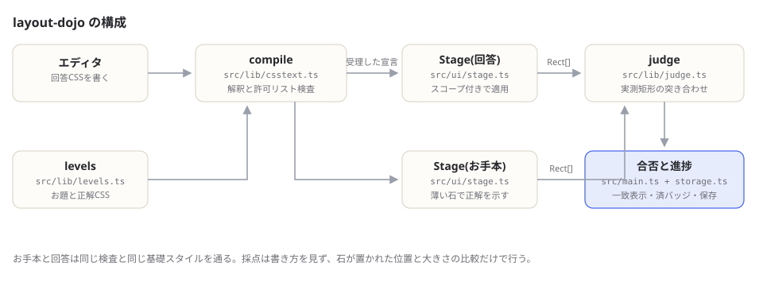

# layout-dojo

[](https://github.com/miruky/layout-dojo/actions/workflows/ci.yml)
[](https://github.com/miruky/layout-dojo/actions/workflows/deploy.yml)
[](https://www.typescriptlang.org/)
[](https://opensource.org/licenses/MIT)

**石を目標の位置に納めて学ぶ、FlexboxとGridのお題クリア形式CSSレイアウトパズル**

## 概要

layout-dojo は、庭に置かれた石をCSSだけで目標の位置に動かすパズルである。画面には薄い枠で「お手本」の位置が示され、エディタに書いたCSSが即座に庭へ適用される。すべての石がお手本に重なれば合格となり、次のお題に進む。お題は display: flex の一行から始まり、justify-content・align-self・flex-grow を経て、grid-template-areas による区画割りまで17問で段階的に進む。

採点方法に特徴がある。書いたプロパティが模範解答と同じかどうかは見ず、適用後の石の実測位置・大きさをお手本と突き合わせる。そのため模範と違う書き方の別解でも、結果が一致していれば合格になる。石がまだ合っていないときは、ずれている石を「左へ12px」のように進むべき向きで案内する。進捗と書きかけの回答、配色の好みはlocalStorageに残り、いつでも続きから再開できる。

公開先: https://miruky.github.io/layout-dojo/

### なぜ作ったのか

FlexboxとGridは、プロパティの説明を読むだけでは身につかず、値を変えて結果を見る反復で覚えるものだと考えている。実務のCSSでそれをやると壊す対象があるが、パズルなら何度でも試せる。海外には同種の学習ゲームがあるものの、日本語で、答えの丸暗記ではなく実測一致で採点し、URLを開くだけで動く軽さのものが欲しかった。

## アーキテクチャ



回答CSSと正解CSSは同じパーサと許可リスト検査(compile)を通り、それぞれスコープ付きの style 要素として回答ステージとお手本ステージに適用される。採点(judge)は両ステージの石の実測矩形を比較するだけで、CSSの中身には関知しない。レイアウトに関係しないプロパティ(position や margin など)は許可リストで拒否し、お題の趣旨が崩れないようにしている。

## 技術スタック

| カテゴリ             | 技術                                  |
| :------------------- | :------------------------------------ |
| 言語                 | TypeScript 5(strict、実行時依存なし)  |
| ビルド               | Vite 6                                |
| テスト               | Vitest 2 + happy-dom                  |
| リンタ・フォーマッタ | ESLint 9(typescript-eslint)+ Prettier |
| CI / 配信            | GitHub Actions + GitHub Pages         |

## 使い方

左の一覧からお題を選び、回答CSSを書いて「適用する」(Cmd+Enter または Ctrl+Enter)を押す。石の動きはアニメーションで追え、お手本と一致した石には印が付く。一致しない石は進むべき向きで案内される。「書き直す」で初期コードに戻る。エディタの外では `[` と `]` で前後のお題に移動でき、右上のボタンで配色を自動・ライト・ダークに切り替えられる。

書けるのは各お題が指定するセレクタ(庭 `.niwa` と、お題によっては特定の石 `.ishi-1` など)に対するレイアウト系プロパティだけで、それ以外は理由付きで断られる。

```
第4問 ど真ん中:

.niwa {
  display: flex;
  justify-content: center;
  align-items: center;
}

適用する → 石 1 / 1 → 合格
```

使えるプロパティは display、flex-direction、flex-wrap、justify-content、align-items、align-content、gap、order、align-self、flex-grow、grid-template-columns / rows / areas、grid-column / row、grid-area、place-items などレイアウトに関わるものに限る。判定は1.5pxの許容誤差を持つ実測比較なので、お手本と同じ見た目になる書き方ならどれでも正解になる。

## プロジェクト構成

- `src/lib/` — DOM非依存のロジック。CSSの解釈と許可リスト検査(`csstext.ts`)、実測矩形の採点(`judge.ts`)、お題定義(`levels.ts`)、進捗の永続化(`storage.ts`)
- `src/ui/` — DOMを扱う層。庭ステージの描画・CSS適用・FLIPアニメーション(`stage.ts`)
- `src/main.ts` — 画面の組み立てと配線
- `docs/` — 構成図
- `public/` — ロゴ・ファビコン
- `.github/workflows/` — CI(lint・テスト・ビルド)とGitHub Pagesへのデプロイ

## はじめ方

### 前提条件

Node.js 22以上。

### セットアップ

```bash
git clone https://github.com/miruky/layout-dojo.git
cd layout-dojo
npm ci
npm run dev
```

### テストの実行

```bash
npm test
```

### Lintの実行

```bash
npm run lint
```

### ビルドとデプロイ

```bash
npm run build
```

GitHub Pagesのようにサブパスへ配信する場合は `LAYOUTDOJO_BASE=/layout-dojo/` を付けてビルドする。`main` へのpushで `deploy.yml` がビルドとPagesへの反映まで行う。

## 設計方針

- **実測で採点する** — 模範解答との文字列比較ではなく、適用結果の矩形比較で合否を出す。正解の書き方を増やすたびに判定を直す必要がなく、CSSの「同じ結果になる複数の書き方」をそのまま受け入れられる。
- **許可リストで絞る** — セレクタとプロパティの両方を許可リストで検査する。位置やサイズを直接指定する抜け道(position、margin、width)を塞ぐと同時に、任意CSSの注入面も閉じる。
- **お手本も同じ経路を通す** — 正解CSSも回答と同じ検査・同じ基礎スタイルで描画するため、お題の定義ミスはテストで機械的に検出できる(全お題の正解が検査を通ること、初期コードのままでは合格しないことを検証している)。
- **判定はビューポート非依存** — お手本と回答は同じ大きさの庭で測るので、画面幅が変わっても両者が同じ条件でずれ、合否は安定する。
- **モーションは控えめに** — 石の移動はFLIPで追従させ、`prefers-reduced-motion: reduce` では止める。

制約も明記しておく。扱うのは石の配置だけで、レスポンシブやメディアクエリ、インライン要素の流し込みはお題にしていない。判定は1.5pxの許容誤差を持つため、サブピクセル単位の違いは同一とみなす。

## ライセンス

[MIT](LICENSE)
